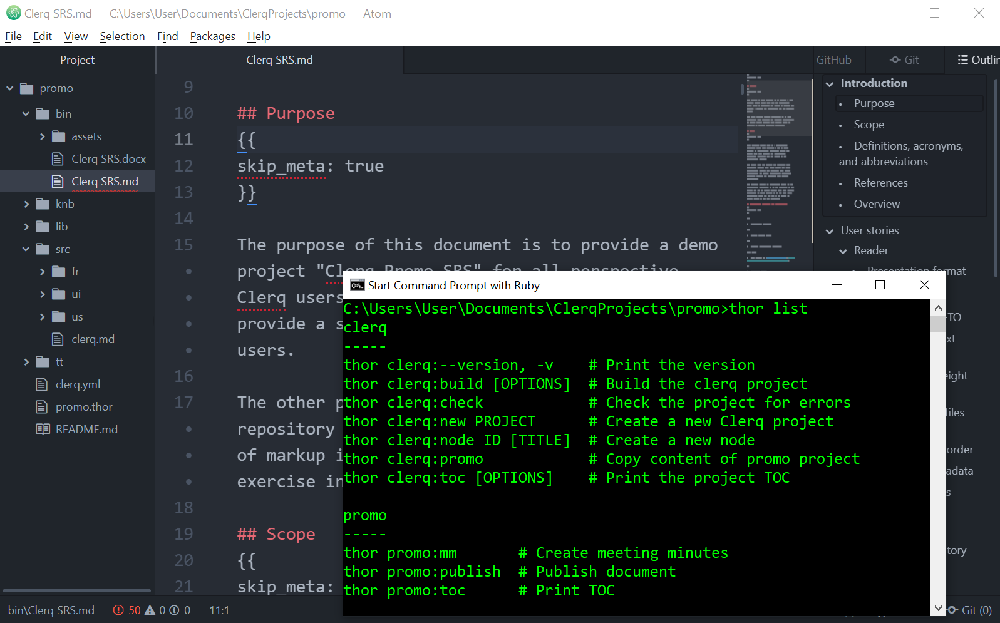

__This project is CLOSED! Use [nvoynov/marko](https://github.com/nvoynov/marko) if you still interesting in compliling markup from separated sources__

# Clerq

__What is Clerq?__

The Clerq is a toolbox for manipulating the hierarchy of text data placed in separate markdown files. It implements three basic ideas:

1. Text data repository in file system, based on markdown files with few extra conventions.
2. Ruby gem that provides access to the text hierarchy from the repository.
3. Basic CLI to manage the repository and compile the text data to documents based on erb-templates.

__What for?__

The Clerq is suitable for writing thick structured texts. The initial purpose for the system was the "requirements management in file system" and it supposed to help in writing stuff like Vision, RFP, URD, SRS, SAD, and deriving various requirements based artifacts. But now it seems much wider.

## Installation

Install it yourself as:

    $ gem install clerq

## Promo



Inside Clerq there is a demo project that was created and is still used to develop Clerq itself and its script-extensions. You can see the project [here](https://github.com/nvoynov/clerq/tree/master/lib/assets/promo) ([requirements sources](https://github.com/nvoynov/clerq/tree/master/lib/assets/promo/src) and produced documents [Clerq SRS.md](https://github.com/nvoynov/clerq/blob/master/lib/assets/promo/bin/Clerq%20SRS.md), [Clerq SRS.docx](https://github.com/nvoynov/clerq/blob/master/lib/assets/promo/bin/Clerq%20SRS.docx))

I am sure this project will be useful when you get to know the product. So, I propose to open it now and look inside as you move forward. Do the following in your console:

    $ clerq new promo
    $ cd promo
    $ clerq promo
    $ atom .
    $ thor list

## Usage

The Clerq is entirely based on one single domain entity `Node` that represents a node of tree hierarchy and provides `id`, `title`, `body`, and `metadata` attributes. It supposes the following simple workflow:

* you create files with text content,
* and manipulate the data by scripts.

### Project

The Clerq project lives in the following folders structure that will be created by `clerq new <project>`:

* `bin/` - for output documents;
* `bin/assets` - for assets;
* `knb/` - knowledge base;
* `lib/` - place for extra Ruby code;
* `src/` - source data repository;
* `tt/` - templates;
* `<project>.thor` - see [Scripting](#scripting);
* `clerq.yml` - project settings;
* `README.md`.

### Writing

The Clerq reads nodes from a set of separate files and assembles it to a single hierarchy. There are a few conventions for a separate file that will become a part of hierarchy.

#### Files

The first convention is the scheme how a markdown content becomes the `Node` entity.

```markdown
# [p2] Part two
{{parent: top}}

Body
```

Where

* `#` familiar markdown header that indicates a new `node`;
* `[p1]` is an optional identifier that becomes `node.id`;
* `Part two` is an optional `node.title`;
* `{{parent: top}}` is an optional metadata section that becomes `node.meta`;
* and finally `Body` is an optional `node.body`.

```markdown
# Part two
{{id: p1, parent: top}}

Body
```

Every new header (`#`) at any level indicates a new node. When a file contains headers of different levels, the nodes will be created in a natural hierarchy based on header levels. So as the result of reading the content below, the Clerq will create the natural hierarchy with root node `Top` that holds two child nodes `First` and `Second`.

```markdown
# Top
## First
## Second
```

One more extra thing is links. You can place links to other nodes in the body section of the file content by using `[[<id>]]` macro. It can be handled in templates.

#### IDs

To be able to build a hierarchy or to refer to other nodes, one needs each node to have its unique id. And you can pass it straight into markdown header `# [node id] node title` or provide it through `{{id: }}`.

ID can start with one dot, like `[.suffix]`, and clerq will build the node id as `node.parent_id + node.id`.

When and ID is not provided, the Clerq will generate it automatically. Let's see the example of node:

```markdown
# User requirements
## Requirement 1
## Requirement 2
# Function requirements
## [cm] Components
### [.fm] File manager
### Logger
```

According to rules mentioned above the example will be translated as followed:

```markdown
# [01] User requirements
## [01.01] Requirement 1
## [01.02] Requirement 2
# [02] Function requirements
## [cm] Components
### [cm.fm] File manager
### [cm.01] Logger
```

#### Meta

The excerpt, the text in brackets `{{ }}` that follows by the header, contains node attributes. And the second convention mentioned in [Writing](#writing) section is the followed magic metadata attributes that specify parameters of a hierarchy:

1. `id: <id>` specifies id through metadata; when in provided together with `# [<id>]`, the last has priority;
2. `parent: <id>` indicates that the node belongs to a node with specified `id`;
3. `order_index: <id1> <id2>` indicates that child nodes must be lined up in specified order.

You can place in metadata any simple string that suitable for providing additional information like status, originator, author, priority, etc. E.g.

```markdown
# [r.1]
{{parent: r, status: draft}}

# [r.2]
{{parent: r
}}

# [r.3]
{{
parent: r}}
```

#### Assets

When you want to provide some assets or links to something outside the repository you can provide the link to the assets. Put the asset in the `bin/assets` folder and specify the link.

```markdown
# [ent] Entities

The following picture shows something


```

### CLI

Clerq provides CLI that is based on Thor, so all standard thor features are supported. To print all Clerq commands type `$ clerq help` in your console. To see the list of all the project-specific commands type `thor help <project>`.

#### Create new project

To create a new project run `new` command:

    $ clerq new <project_name>

#### Create new file

The simplest way of adding new items to the project is to add a new file to the `src` directory. Of course, Clerq also provides the command `node` that can create template-based files:

    $ clerq node ID [TITLE] [-t TEMPLATE]

__Assets__

If you are using images or other assets, you should place it to `bin/assets` directory and write markdown link like ``

__Templates__

You also can prepare your own templates it `tt` folder and provide template through `-t/--template` option. The content of the template will be placed on the created file.

#### Check repository

Because of lots of handwriting there can be some specific errors in repository. The most obvious are:

* non-unique identifiers;
* links to and id that does not exist:
   * for `parent` attribute;
   * in `order_index`;
   * in `body`.

The system provides command `clerq check` that will check the repository for these kinds of errors.

    $ clerq check

#### Build project

Clerq provides the ability to combine all the text data from the project repository and create the final document. To create such document you can use `clerq build` command:

    $ clerq build

It will create final document with default file name, title, and by default erb template. These default values are defined in `clerq.yml` and you should change it according to your aim.

Default values of final document parameters are:

* `document: <project_name>`;
* `template: default.md.erb`;
* `title: <project_name>`.

You also can specify these settings through `clerq build` options:

* `-t/--template TEMPLATE` provides the ability to specify template;
* `-o/--output FILE_NAME` provides the ability to specify output file name.

__Queries__

Clerq provides the ability to query data that match query criteria. To query data you should use `-q/--query QUERY_STRING` option where `QUERY_STRING` is ruby code that will test if each node matches the  `QUERY_STRING`. For example, `node.tile == 'Functional requirements'` or `node.id == 'us'`.

#### Print TOC

Sometimes it helpful to check repository structure by `clerq toc` command. The command also supports `-q/--query QUERY_STRING` option.

### Scripting

The section assumes that you are familiar with Ruby or some other programming language.

Using the basic commands described in [CLI](#cli) section gives you just the ability to create final documents or other output. But this is just the tip of the iceberg, just the beginning, and you can do much more than that with Clerq.

A usual scenario will consist of two simple steps:

1. Get data hierarchy from the repository.
2. Do some processing of the hierarchy.

#### Node class

The [Writing](#writing) section provides the basic knowledge to understand Clerq, and now it is the right time to see the [Node class](https://github.com/nvoynov/clerq/blob/master/lib/clerq/entities/node.rb). It implements the Composite pattern.

#### Services

Clerq provides the following main service objects:

* `LoadAssembly` loads whole repository to Node class;
* `CheckAssembly` checks the assembly for errors (ids and links);
* `QueryNode` provides ability to query nodes from assembly;
* `QueryTemplate` returns template by the template name;
* `CreateNode` crates new node in the repository;
* `RenderNode` returns text rendered by ERB.

The first part of each repository related task is to get repository assembly. It can be performed through  `NodeRepository#assemble` or `LoadAssembly.call()`. Each of these methods returns Node that provides [Enumerable](https://ruby-doc.org/core-2.6.5/Enumerable.html) interface.

Let's see an example. Assume that you are developing a "User requirements document" and the project policy requires that each user requirement must have the parameter called `originator`. You can write the policy as followed:

```ruby
require 'clerq'
include Clerq::Services

# supposed you have something like user requirements document
node = LoadAssembly.()
node = QueryNode.(node: node, query: "node.title == 'User requirements'")
miss = node.drop(1).select{|n| n[:originator].empty? }
unless miss.empty?
  errmsg = "`Originator` is missed for the following nodes:\n"
  errmsg << miss.map(&:id).join(', ')
  raise Error, errmsg
end
```

Instead of adding extra scripts files somewhere in the project, you can write tasks in `<project>.thor` (see [Automating](#automating) section for details.)

#### Root Node

A hierarchy starts form root node and Clerq provides the root node with parameter `title` specified in `clerq.yml` file. The subject is a bit tricky actually and there are few extra considerations I try to explain below (and you can always see tests)

When your repository stills empty, the Clerq will provide you with the root node. From one point it resembles the NullObject.

When you have a few root nodes in your repository, those become  direct childs of the root node. But when your repository contains single root node, the Clerq will return the single node as root node.

The following example does not provide root node and it causes adding root node from `clerq.yml`.

```markdown
# User requirements
# Functional requirements
```

But this one provides, and the root node will be `Product SRS`.

```markdown
# Product SRS
## User requirements
## Functional requirements
```

The QueryAssembly follows the similar logic

* When query result is empty, the Clerq will provide result with QueryNullNode (node.title == `Query`, node[:query] == QUERY_STRING)
* When query result contains single node, it becomes a root query node.
* When query result contains more than one, those becomes a child of root query node.

### Automating

The Clerq creates `<project>.thor` where you can place your project-specific tasks. It is a standard [Thor](https://github.com/erikhuda/thor) that brings you all script automation power through CLI and to dive deeper just spend a few minutes reading [the poject wiki](https://github.com/erikhuda/thor/wiki).

Let's move the code from [Scripting](#scripting) section to the `<project>.thor` file:

```ruby
require 'clerq'
include Clerq::Services

class MyDocument < Thor
  namespace :mydoc

  no_commands {
    def stop_on_error!(errmsg)
      raise Thor::Error, errmsg
    end
  }

  desc 'check_originator', 'Check :originator'
  def check_originator
    node = LoadAssembly.()
    node = QueryAssembly.(node: node, query: "node.title == 'User requirements'")
    miss = node.drop(1).select{|n| n[:originator].empty? }
    unless miss.empty?
      errmsg = "`Originator` is missed for the following nodes:\n"
      errmsg << miss.map(&:id).join(', ')
      stop_on_error!(errmsg)
    end
  end
end
```

And then you can run the task by

    $ thor mydoc:check_originator

This example is just very basic and your automation scripts could be much more complex.

Another quick example is the [clerq.thor](https://github.com/nvoynov/clerq/blob/master/clerq.thor) file that was created just to overcome handling curly bracket `{{}}` in Jekyll and now I run `thor clerq:src:docs` every time after changing this file.

### Templating

The output of the `clerq build` command can be precisely adjusted by modifying the corresponding "erb" template.

One can see the standard template in [default.md.erb](https://github.com/nvoynov/clerq/blob/master/lib/assets/tt/default.md.erb). It produced output in [Pandoc's Markdown](https://pandoc.org/MANUAL.html#pandocs-markdown) format and supports the following macros in node body:

* `{{@@list}}` - replaces the macro with the list of child nodes;
* `{{@@tree}}` - replaces the macro with the tree of child nodes;
* `{{@@eval}}` - eval ruby code inside the brackets;
* `{{@@skip}}` - skip all content inside the brackets.

### Publishing

In addition to the `clerq build` command one can find an example of basic documents management tasks in the [lib/clerq_doc.thor](https://github.com/nvoynov/clerq/blob/master/lib/assets/lib/clerq_doc.thor) (it will be placed in new project `lib` folder). You can find there two example of commands that you can start your own publishing automation.

* `thor clerq:doc:publish` will create `<project>.docx` and `<project>.html`;
* `thor clerq:doc:grab` will import provided document into the current project repository.

## Known issues

### Thor version

The one issue I certain in is when you are using different version of thor, your custom scripts won't work.

## Some considerations

### Some obvious things

Use modern text editor that provides projects tree. like Atom, Sublime, etc.

Hold your projects in Git.

Use pandoc for generating output in different formats

### Several artifacts

Because Clerq has `-q/--query QUERY_STRING` option you can be interested in developing several different artifacts in one project.

I was considering such an example to develop all software project documents in one clerq project but decided that it is more properly to develop one single artifact per project because usually, each artifact has its own develop-review-release cycle.

Also, I was considering to add some kind of a "top" project that is just a wrapper for individual projects inside (each of them is the clerq project, and the top project just provides a specific set of commands.) I was speculating about some kind of shared content and tracing nodes between different artifacts. But for the moment I have no full-fledged vision.

## Development

The project is bundled, so after checking out the repo, run `bundle` to install dependencies. Then, run `bundle exec rake test` to run the tests. You can also run `bin/console` for an interactive prompt that will allow you to experiment.

To install this gem onto your local machine, run `bundle exec rake install`. To release a new version, update the version number in `version.rb`, and then run `bundle exec rake release`, which will create a git tag for the version, push git commits and tags, and push the `.gem` file to [rubygems.org](https://rubygems.org).

## Contributing

Bug reports and pull requests are welcome on GitHub at https://github.com/nvoynov/clerq.

## License

The gem is available as open source under the terms of the [MIT License](https://opensource.org/licenses/MIT).
