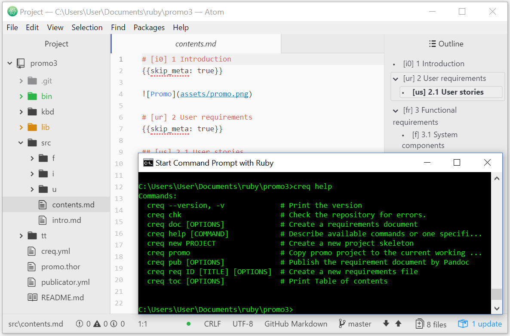

% Clеrq SRS
% generated by Clerq on May 28, 2021 at 11:06
% default template

# Introduction
{{
skip_meta: true
}}

## Purpose
{{
skip_meta: true
}}

The purpose of this document is to provide a demo project "Clerq Promo SRS" for all perspective Clerq users to introduce the system by example and provide a sandbox for experiments for the existing users.

The other purpose (rather technical) is to have repository that provides all possible combinations of markup inside (links, ids, macros, etc.) to exercise in writing documents templates.

## Scope
{{
skip_meta: true
}}

This software system will be a command-line interface (CLI) that provides a set of tools related to requirements management tasks. The system will also provide the requirements repository structure and the format of the requirements sources.

The system does not provide any graphical user interface. Assumed that users create and write requirements through any available text editor application, and manage requirements repository structure through any available file manager application.

Any features related to restricting access to the requirements repository or to the functions of the system are out of scope. Assumed that each project repository is under control of an SCM tool (Git, Subversion, etc.) and the SCM is in charge of user's access to the SCM artifacts.

## Definitions, acronyms, and abbreviations
{{
skip_meta: true
}}

CLI

:   Command-line interface

VCS

:   Version control system

SCM

:   Software configuration management

User story

:   User stories at [www.agilealliance.org](https://www.agilealliance.org/glossary/user-stories)

OS

:   Operations System

## References
{{
skip_meta: true
}}

1. [Markdown Guide](https://www.markdownguide.org/)
2. [Pandoc User's Guide](https://pandoc.org/MANUAL.html)
3. [Git User's Manual](https://git-scm.com/docs/user-manual.html)

## Overview
{{
skip_meta: true
}}

The remaining sections of this document provide user requirements and functional requirements of the system.

The next chapter [[us]] introduces the system from User Stories' point of view and establishes the context for the functional requirements. The chapter is organized by user roles.

The following chapter [[fr]] describes detailed requirements for functions and user interfaces that are based on user stories from the previous chapter. The chapter is structured around system components and is written primarily for developers and quality assurance specialists.

# User stories
{{
skip_meta: true
}}

## Reader

A requirements reader uses requirements in his day to day work as an input for other project activities or participates in the requirements review process.

### Presentation format

As a reader, I want to get requirements in a particular document format (PDF, Html, MS Word, OpenDocument, etc.), so that I can use my usual tools to work with the document.

## Writer

A requirements writer / author / developer / analyst

### README, HOW-TO

As a requirements analyst who visits the project promo page, I want to get some introduction to the project and its features, so that I understand how close it meets my needs.

{{@@skip it just requires that the project should have README.md}}

### Write in plain text files

As a requirements writer, I want to develop and store requirements in plain text, so that my readers and I would not need to install any specialized software to work with requirements.

### Using of lightweight markup language

As a requirements writer, when I work on the requirements text, I want to use a lightweight markup language (LML), so that it still plain text and, at the same time, I have basic formatting capabilities of style and structure of a text, lists, and tables.

### Set of separate files

As a requirements writer, when I develop requirements, I want to structure the entire set of requirements as a set of separate files and folders, so that I have a high degree of agility but some drawbacks also ...

* I can write different complex topics in different files and folders;
* I can share the same repository with other authors without  problems like the necessity to work with the same file simultaneously more that one person:

{{@@skip just curious if the user stories format really suited there for ... these rather features and benefits or quality properties than stories}}

### Requirements subordination and order

As a drawback for the previous story when I have requirements in separated files, I need an ability to specify requirements subordination and output order through separated files, so that I can combine all requirements into the consistent repository.

### Supporting Metadata

As a requirements writer, when I develop requirements, I want to mark requirements text by some metadata (source, author, dependencies, etc.), so that I can use the metadata for tagging, searching, selection, referring, etc.

### Supporting Links

As a requirements writer, when I develop requirements, I want to link those with each other through simple references, so that I refer from one requirement to others.

### Requirements templates

As a requirements writer, when I develop requirements, I want to create and use requirements templates, so that I simplify my work, improve productivity and provide basic writing style.

### Checking repository
{{
topic: true
}}

As a requirements writer, I want to check requirements repository for different possible errors, so that I fix the errors and have consistent repository.

Manual files writing and writing in separate files especially can cause the following errors:

* Errors in structure of a requirements file;
* Errors in linking or ordering requirements;
* References that not exist in the repository;
* Duplicates of requirements identifiers.

### Querying requirements

As a requirements writer, at any time, I want to query requirements (based on its attributes such "id", "title", "body", and metadata), so that I can have different subsets of requirements based on my needs.

### Combining into documents

As a requirements writer, at any time, I want to combine requirements to a single consistent requirements specification, so that I can have requirements draft and releases.

### Providing unique identifiers

As a requirements writer, I want to have automatically created unique identifiers for the requirements where it omitted, so that I will always have unique identifiers for all requirements.

### Document templates

As a requirement writer, I want the system support ability to chose different templates for documents, so that I can have templates for different purposes (drafts and releases) and even software products (GitHub Markdown, Gitlab Markdown, Pandoc Markdown to convert to docx, odt, or pdf.)

### Create own document template

As a requirements writer, I want to have ability to create my own templates or modify existing templates, so than I can do template tuning for my needs.

### Script automation

As a requirements analyst, I want have ability to automate my working tasks related to requirements, so that I can write scripts related to publishing, reviewing or deriving other artifacts based on the requirements (backlog, estimation sheet, traceability matrix, etc.).

# Functional requirements
{{
skip_meta: true
}}

## Components

The system shall provide the following components:

{{@@list}}

### Node

The system shall provide the `Node` component that represents one single node of a document. The component shall provide the following function:

{{@@list}}

#### Read node from markup text

The system shall provide the ability to read node from lightweight markup language (markdown) to [[ent.node]].

#### Write node to markup text

The system shall provide the ability to write node from [[ent.node]] to lightweight markup language (markdown).

### Repository

#### Read repository

The system shall provide the function to read repository from separate files and folders and combine it to [[ent.node]] under root document node.

#### Query repository

The system shall provide the function to query repository by providing a query string

### Templates manager

The system shall provide `Template manager` component. The component shall provide the following functions:

{{@@list}}

#### Find template

The system shall provide function `find` for templates

__Input__

Parameter | Type   | Required | Description
--------- | ------ | -------- | -----------
id        | String | Yes      | Template identifier

__Output__

Template body (see [[ent.tt]]) by provided template `id` parameter.

### Writer

The system shall provide the `Writer component`. The component shall provide functions of writing requirements repository to markup text.

#### Write function

The `Writer` component shall provide the function `write`.

__Input__

Parameter | Type | Required | Description
--------- | ---- | -------- | -----------
node      | Node | Yes | see [[ent.node]]
template  | Template | Yes | se [[ent.tt]]

__Output__

Text presentation of `node` parameter according to `template` parameter

## Entities

### Node entity

The system shall provide `Node` entity that provide the following attributes:

Attribute | Type   | Required | Default | Description
--------- | ------ | -------- | ------- | -----------
id        | String | Yes      | ""      | Node identifier
title     | String | Yes      | ""      | Node title
meta      | Hash   | Yes      | {}      | Node metadata
body      | String | Yes      | ""      | Node body
items     | Array<Node> | Yes | []      | Array of child nodes

#### System node options

The system through node metadata shall provide the following system options:

Option      | Example | Description
----------- | ------- | -----------
parent      | parent: fr | specifies the node parent
skip_meta   | skip_meta: true | force the system to skip printing metadata
order_index | order_index: .1 .2 | force the system to use specified order for child nodes

### Template entity

The system shall provide `Template` entity that provide the following attributes:

Attribute | Type   | Required | Default | Description
--------- | ------ | -------- | ------- | -----------
id        | String | Yes      | ""      | Template identifier
body      | String | Yes      | ""      | Template body

## User Interface

### CLI

The following requirements assumed that all CLI commands have to be called in a directory that contains a certain clerq project.

The system shall provide the following CLI commands:

{{@@list}}

#### Project settings

The system shall provide settings file for clerq project. It should be placed under root clerq project directory and called `clerq.yml`.

Clerq project setting file shall provide the following options:

* `document`, string, required, represent file name of output document by default;
* `template`, string, required, represent template of output document by default;
* `title`, string, required, represent title of the output document;
* `author`, string, optional, represent optional document author.

#### Getting version

The system shall provide command `clerq --version`. When the user requests the command the system shall print its version.

#### Help

The system shall provide command `clerq help`. When the user requests the command, the system shall print the list of all clerq CLI commands with a short description of each command.

##### Input parameters

The command shall provide the following input parameters:

* `COMMAND`, string, optional, represent name for the command.

##### .01

When the `COMMAND` parameter is provided, the system shall print the detailed description of the command with all supported parameters and options.

#### Creating new project

The system shall provide command `clerq new`. When the user requests the command the system shall create a new clerq project according to input parameters.

{{@@skip TODO what is the project?}}

##### Input parameters

The command shall provide the following input parameters:

* `PROJECT`, string, required, represent the name of the new project.

##### .01

When parameter `PROJECT` not provided, the system shall stop the command execution and print the error message `Parameter "PROJECT" required!`.

##### .02

When parameter `PROJECT` provided and a directory called according to the parameter value exists, the system shall stop the command execution and print the error message `Directory "PROJECT" exists!`.

#### Checking project

The system shall provide command `clerq check`. When the user requests the command the system shall check the clerq repository for errors.

##### .01

When any errors have found during checking, the system shall print the errors grouped by error type. The following errors type shall be checked:

* Non-unique identifiers;
* Unknown/wrong parents;
* Unknown/Wrong links;
* Wrong order_index attribute.

##### .02

When errors have not found, the system shall print the message `No errors found. Everything is fine.`

#### Building project

The system shall provide command `clerq build`. When the user requests the command the system shall combine all requirements in the project repository and build the output document according to input parameters.

##### Input parameters

The command shall provide the following input parameters:

* `-o/--output`, string, optional, represent name for the output document;
* `-t/--template TEMPLATE`, string, optional, represent a template for building the document;
* `-q/--query QUERY`, string, optional, represent query string for requirements.

##### .01

When `-o/--output` parameter is not provided, the system shall use the default file name from settings of the project.

##### .02

When `-o/--output` parameter is provided, the system shall save the generated document under the provided name.

##### .03

When `-t/--template` parameter is not provided, the system shall use the default template from settings of the project.

##### .04

When `-t/--template` parameter is provided, the system shall check that the provided template exists and use it for document generation.

##### .05

When `-q/--query` parameter is provided, the system shall check if the provided query is correct query string and select requirements for building the document according to the query.

# Appendix
{{
skip_meta: true
}}

